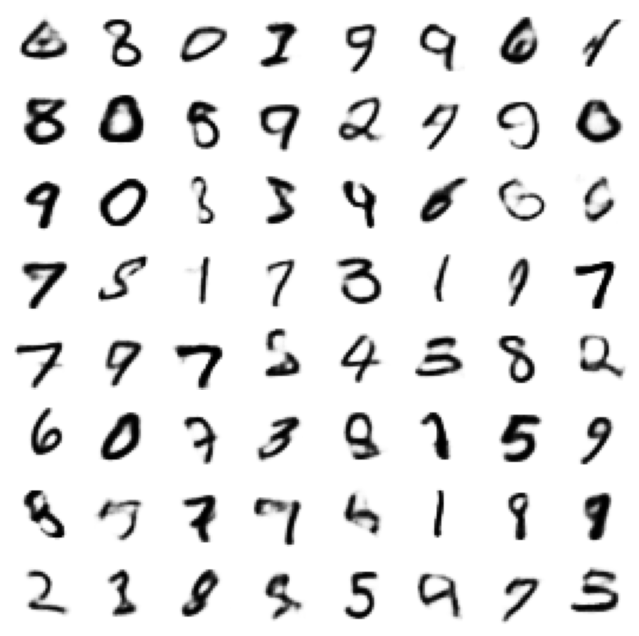
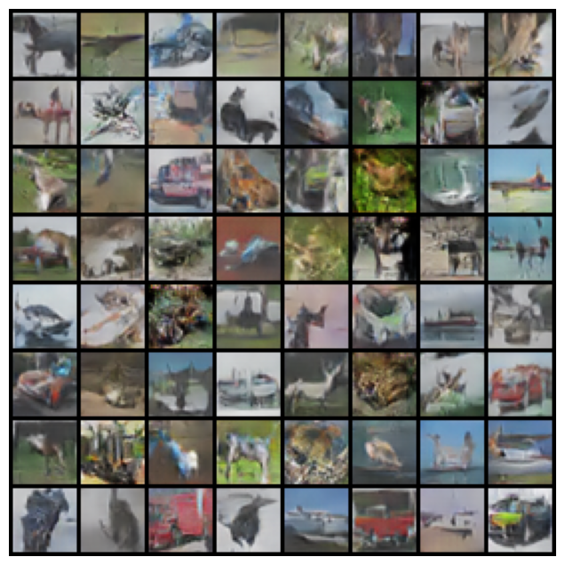
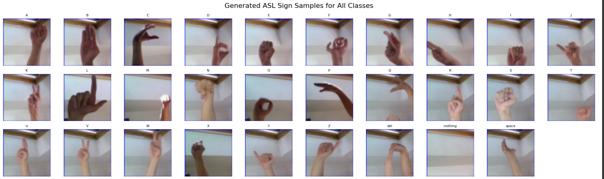
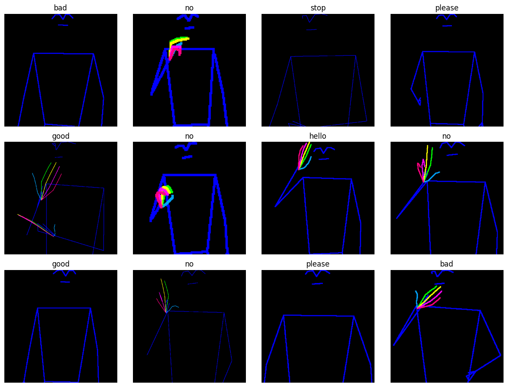

# ASL Sequence Generation using Diffusion Model

**Course:** CSE 676 – Deep Learning (Spring 2025)  

**By:**  
- Harshit Agrawal ([LinkedIn](https://www.linkedin.com/in/harshitnitpy/))
- Ashtik Mahapatra ([LinkedIn](https://www.linkedin.com/in/ashtik-mahapatra/))

---

## Table of Contents
1. [Project Objectives](#project-objectives)
2. [Initial Experiments with Standard Datasets](#initial-experiments-with-standard-datasets)
3. [Pivot to ASL Generation](#pivot-to-asl-generation)
4. [ASL Image and Video Generation Pipeline](#asl-image-and-video-generation-pipeline)
   - [4.1 ASL Alphabet Dataset](#41-asl-alphabet-dataset)
   - [4.2 Skeleton Extraction with Mediapipe](#42-skeleton-extraction-with-mediapipe)
   - [4.3 Fine-Tuning Diffusion with LoRA](#43-fine-tuning-diffusion-with-lora)
   - [4.4 Fluent Sentence-Level ASL Video Generation](#44-fluent-sentence-level-asl-video-generation)
5. [Challenges and Solutions](#challenges-and-solutions)
6. [Impact and Future Work](#impact-and-future-work)
7. [References](#references)

---

## Project Objectives

The primary objectives of the project were:

- Explore generative modeling techniques (VAEs, GANs, Diffusion) on standard datasets.  
- Transition to a meaningful application: **ASL (American Sign Language) generation**.  
- Build a full pipeline that converts ASL words or sentences into synthetic videos.  
- Integrate skeleton extraction, LoRA fine-tuning, and conditional generation for coherent ASL visualization.

---

## Initial Experiments with Standard Datasets

**Code:** initial_experiments.ipynb

We began with foundational image generation techniques using two standard datasets:

### MNIST  



- **VAEs** produced blurry digit reconstructions.  
- **GANs** improved image sharpness but suffered from training instability.

### CIFAR-10  



- Results with vanilla GANs were limited in structure and resolution, motivating a pivot to structured generation tasks.

---

## Pivot to ASL Generation

Initially, our project aimed at generative modeling using Variational Autoencoders (**VAEs**) and Generative Adversarial Networks (**GANs**) on standard datasets such as MNIST and CIFAR-10. These experiments provided foundational insights into generative modeling but revealed limitations in real-world applicability and visual complexity. To enhance **practical utility and societal impact**, we pivoted our project to generating **American Sign Language (ASL)** images and videos, leveraging deep generative techniques to facilitate better accessibility tools.

---

## ASL Image and Video Generation Pipeline

**Code:** 
- **ASL Alphabet generation:** text_to_asl_image.ipynb
- **Mediapipe & ASL Video Sequence generation:** text_to_asl_image.ipynb

### 4.1 ASL Alphabet Dataset

**Dataset:** [ASL Alphabet (Kaggle)](https://www.kaggle.com/datasets/grassknoted/asl-alphabet)

- **Total Images:** ~87,000  
- **Classes:** 29 (26 letters + 3: `del`, `nothing`, `space`)  
- **Image Format:** JPG  
- **Image Size:** 200×200 pixels  
- **Image per class:** ~3000 

**Structure:**
```
asl_alphabet_train/
├── A/
├── B/
├── ...
├── Z/
├── del/
├── nothing/
└── space/
```

Each folder represents a gesture class containing thousands of hand gesture images captured under varied but mostly controlled settings.

#### Dataset Usage
- Used for early image generation with VAEs and GANs.  
- Helped learn the distribution of ASL letter poses.  
- Provided the foundation for later diffusion-based generation.

**Additional Dataset:** [WLASL (Processed)](https://www.kaggle.com/risangbaskoro/wlasl-processed)  
Used for extracting pose-based skeletons via **Mediapipe** for LoRA fine-tuning.

---

### Model Architecture

Implemented a **Conditional U-Net** for image generation, conditioned on both class labels and diffusion timesteps.

**Key Components**
- **Residual Blocks:** GroupNorm + SiLU + Conv layers  
- **Label Embedding:** Encodes ASL letter class  
- **Time Embedding:** Sinusoidal timestep encoding  
- **Encoder–Decoder:** Skip connections for stable gradient flow

```python
class ConditionalUNet(nn.Module):
    def __init__(self, num_classes, img_size, in_ch=3):
        ...  # time, label, encoder, decoder

    def forward(self, x, t, y):
        ...  # combine embeddings and pass through U-Net
```

---

### Diffusion Process

We use a **DDPM-style** approach.

**Forward Process:** Adds Gaussian noise at each timestep using linearly spaced beta schedule.
**Reverse Process:** U-Net learns to denoise the image conditioned on the timestep and class.

```python
T = 500
betas = torch.linspace(1e-4, 0.02, T)
alphas = 1 - betas
alphas_hat = torch.cumprod(alphas, dim=0)
```

**Training Details**
- **Loss:** MSE between predicted and true noise  
- **Optimizer:** Adam (lr = 2e-4)  
- **Epochs:** 200  
- **Techniques:** Gradient clipping, periodic sample visualization  

**Sample Generation**

Samples are generated by starting from Gaussian noise and applying the reverse diffusion process.


```python
@torch.no_grad()
def sample(model, y, n=1):
    ... # Reverse DDPM steps, conditional on label y
```

Generated images resemble realistic hand gestures corresponding to ASL letters.

### Result

**Conditional U-Net Architecture with Diffusion** : We modified a U-Net to conditionally generate ASL signs based on labels. It was used within a diffusion
pipeline to refine visual fidelity.



This end-to-end pipeline—starting from loading and preprocessing the dataset to training a conditional diffusion model—demonstrates how generative models can be used to synthesize ASL hand signs with finegrained class control.


---

### 4.2 Skeleton Extraction with Mediapipe

We designed a parallelized pipeline for extracting 2D skeleton wireframes from ASL videos using Mediapipe's Holistic model. This stage is critical to create a clean, consistent visual representation of ASL signs for downstream generation.

**Steps**
1. **Video Frame Sampling:** Uniformly selected ```FRAMES_PER_VIDEO = 30``` frames from each video.
2. **Landmark Detection:** Used ```mp.solutions.holistic``` to extract body and hand landmarks.
3. **Skeleton Rendering:**  
   - Body: white skeleton mask  
   - Fingers: color-coded by finger group (thumb/index/middle/ring/pinky)
4. **Post-Processing:** 
    - Applied thinning (Zhang-Suen) and dilation to enhance visibility.
    - Resized each image to 512x512 with centered padding
5. **Parallel Processing:** 
    - Deployed ```multiprocessing.Pool``` with CPU-bound workers.
    - Generated ~30 Frames per gloss across 10 glosses.

```python
def process_task(args):
    gloss, inst = args
    vid_path = os.path.join(VIDEOS_DIR, f"{inst['video_id']}.mp4")
    cap = cv2.VideoCapture(vid_path)
    # Skeleton extraction logic
```



This stage produced clean 2D skeletal wireframes representing hand and body motion.

---

### 4.3 Fine-Tuning Diffusion with LoRA

We fine-tuned **Stable Diffusion v1.4** for ASL skeleton generation using **Low-Rank Adaptation (LoRA)** to reduce GPU demand.

**Architecture**
- Base Model: `CompVis/stable-diffusion-v1-4`
- Tokenizer: `openai/clip-vit-large-patch14`

**LoRA Config**
```python
LoraConfig(
  r=64,
  lora_alpha=32,
  target_modules=["to_q", "to_k", "to_v"],
  lora_dropout=0.1
)
```

**Training Strategy**
- **Loss:** MSE in latent space  
- **Optimizer:** AdamW + OneCycleLR  
- **Precision:** FP32, manual grad clipping  
- **Checkpointing:** Saved best UNet weights  
- **Epochs:** 5–10, batch size = 2  

Each epoch generated a preview “hello” image for validation.

---

### 4.4 Fluent Sentence-Level ASL Video Generation

We developed a **text-to-ASL-video** pipeline combining text-to-image and image-to-image stages.

#### 1. Text-to-Image
```python
img = pipe(prompt="ASL sign for 'hello'", image=init_img, strength=0.5).images[0]
```

#### 2. Image-to-Image Enhancement
- Used real skeleton PNGs as initial inputs  
- Controlled transformation strength (0.4–0.8)

#### 3. Video Stitching
- Generated 50 frames per word  
- Used cosine-fade transitions for smooth blending  
- Held the final frame for readability

```python
alpha = 0.5 - 0.5 * cos(t / transition_frames * pi)
blended = cv2.addWeighted(img1, 1 - alpha, img2, alpha, 0)
```

#### 4. Output

Final `.mp4` videos (e.g., `hello_please_stop.mp4`, `yes_good.mp4`, `no_sorry.mp4`) were stitched using OpenCV.

Text to ASL Video Generation has the output files in the results folder
1. hello_please_stop.mp4
2. no_sorry.mp4
3. yes_good.mp4
---

## Challenges and Solutions

| Challenge | Solution |
|------------|-----------|
| Inconsistent skeletons due to low-res video | Mediapipe Holistic + filtering |
| High GPU demand (Diffusion) | LoRA + mixed precision + checkpointing |
| Training instability | Adaptive optimizers, spectral norm, early stopping |
| Poor frame transitions | Cosine interpolation + frame holding |

---

## Impact and Future Work

This project demonstrates a **scalable, visually coherent ASL video generation pipeline** using advanced diffusion models.

**Future Work**
- Real-time ASL generation  
- Integration with speech-to-text for automated ASL translation  
- Interactive accessibility systems

Our work bridges generative modeling research with real-world inclusivity and communication.

---

## References
1. Ho, J., Jain, A., & Abbeel, P. (2020). *Denoising Diffusion Probabilistic Models*. arXiv:2006.11239  
2. Hu, E. J., et al. (2021). *LoRA: Low-Rank Adaptation of Large Language Models*. arXiv:2106.09685  
3. [Mediapipe Holistic](https://google.github.io/mediapipe/)  
4. [ASL Alphabet Dataset (Kaggle)](https://www.kaggle.com/grassknoted/asl-alphabet)  
5. [CompVis Stable Diffusion](https://github.com/CompVis/stable-diffusion)  
6. [HuggingFace Diffusers & Transformers](https://huggingface.co/docs/diffusers/index)

---
